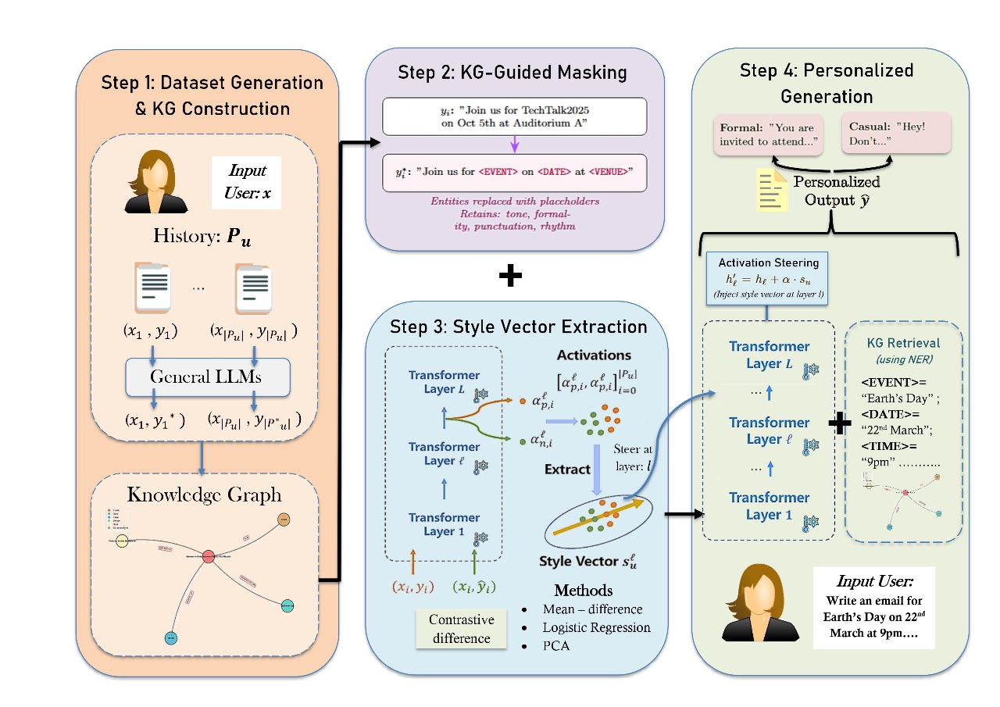

# Disentangling Style and Semantics for Calendar-Driven Text Generation: A Knowledge Graph-Guided Activation Steering Approach


## 🧠 Authors
- **Tanmay Kumar Shrivastava** – BTech Final Year, DSAI, IIT Bhilai  
- **Aditya Bajpai** – BTech Final Year, CSE, IIT Bhilai  
- **Anil Kumar Mandal** – BTech Final Year, CSE, IIT Bhilai  

---




## 📑 Overview
This project proposes a **Knowledge Graph-Guided Activation Steering (KG-GAS)** framework that enables large language models (LLMs) to generate **personalized, stylistically adaptive, and factually consistent** text for **calendar-driven communications** (e.g., invitations, announcements).

Unlike traditional fine-tuning or retrieval-based personalization, this method **disentangles stylistic tone from factual content** by combining:
1. **Knowledge Graph-guided semantic masking**, and  
2. **Contrastive activation-based style vector extraction**.

The system learns a user’s writing tone (formal, casual, etc.) and re-injects it into the model’s hidden layers via **activation steering** — preserving factual details while adapting writing style.

---

## 🧩 System Architecture
The pipeline consists of **four main stages**, as shown in `ImageP.jpeg`:

### **Step 1: Dataset Generation & KG Construction**
- Input user history of event-based emails (`Pu = {(xi, yi)}`).  
- Generate neutral and styled versions (`yi*`) using general LLMs (e.g., Gemini API).  
- Construct a **Knowledge Graph (KG)** capturing entities:
  - `<EVENT>`, `<DATE>`, `<TIME>`, `<VENUE>`, `<HOST>`  
- The KG provides structured semantic grounding for event details.

### **Step 2: KG-Guided Masking**
- Replace factual entities in each email with placeholders.  
  Example:  
  `"Join us for TechTalk2025 on Oct 5th at Auditorium A"` →  
  `"Join us for <EVENT> on <DATE> at <VENUE>"`  
- This preserves tone, rhythm, and punctuation while removing factual details.

### **Step 3: Style Vector Extraction**
- Extract activations from multiple transformer layers for each pair:
  - `(xi, yi*)`: neutral text  
  - `(xi, yi)`: user-styled text  
- Compute **contrastive difference** to isolate user style direction in latent space:
  - Methods: **Mean-Difference**, **Logistic Regression**, **PCA**
- Output: **Style Vector (suℓ)** — represents the user’s unique tone and phrasing style.

### **Step 4: Personalized Generation**
- During generation, inject the style vector into hidden activations:  
  ```python
  h′ℓ = hℓ + α * suℓ
  ```
  where `α` controls style intensity.
- Retrieve factual entities from KG (via NER) to **rehydrate** placeholders.
- Output personalized text such as:  
  - Formal: “You are invited to attend…”  
  - Casual: “Hey! Don’t miss out on…”

---

## ⚙️ Experimental Setup
- **Base Model:** LLaMA 2–7B-hf  
- **Dataset:** 40 event email pairs (Neutral + Casual)  
- **API Used:** Google Gemini 2.5 Flash Lite  
- **Metrics:** ROUGE-L, METEOR  
- **Best Performing Config:**  
  - PCA-based vector extraction  
  - Steering multiplier (α) = **3.0**  

---

## 📊 Results

| Configuration | ROUGE-L | METEOR |
|----------------|----------|---------|
| Pure Activation Steering (no KG) | 0.2024 | 0.1961 |
| **KG-Guided Activation Steering** | **0.2261** | **0.2418** |

- KG-guided setup improves **semantic and stylistic coherence**.  
- PCA-based vector yields **smoother tone modulation**.  
- High α (>3.0) causes hallucinations; α=3.0 gives optimal results.

---

## 🔍 Key Insights
1. **KG grounding** stabilizes factual alignment.  
2. **Activation steering** controls stylistic variation without fine-tuning.  
3. **PCA vectors** capture dominant stylistic variance effectively.  
4. Metrics like ROUGE and METEOR do not fully capture stylistic nuances — future work should include **style-aware evaluation**.

---

## 🚀 Future Directions
- Larger dataset with human-authored stylistic examples.  
- Layer-wise and token-level steering for fine-grained control.  
- Multi-domain extension (e.g., academic abstracts, business letters).  
- Develop neural style classifiers for evaluation.

---

## 🧠 Keywords
`LLM Personalization`, `Knowledge Graph`, `Activation Steering`,  
`Style Disentanglement`, `Contrastive Learning`, `Calendar-driven Generation`

---

## 📂 Files
| File Name | Description |
|------------|-------------|
| **ImageP.jpeg** | Diagram illustrating the full KG-Guided Activation Steering pipeline |
| **IR_Report_Falcons.pdf** | Full research report including methodology, results, and references |
| **README.md** | Documentation and overview of the proposed system |

---

## 📚 References
1. Rimsky et al. (2024), *Steering LLaMA 2 via Contrastive Activation Addition*  
2. Zhang et al. (2025), *Personalized Text Generation with Contrastive Activation Steering*  
3. Prahlad et al. (2025), *Personalizing LLMs using RAG and Knowledge Graphs*  
4. Zhang et al. (2025), *GKG-LLM: A Unified Framework for Generalized Knowledge Graph Construction*  

---

**Citation:**  
Shrivastava, T. K., Bajpai, A., & Mandal, A. K. (2025).  
*Disentangling Style and Semantics for Calendar-Driven Text Generation:  
A Knowledge Graph-Guided Activation Steering Approach.*  
ACM Proceedings, IIT Bhilai, India.  
DOI: [10.48550/arXiv.2505.09945](https://doi.org/10.48550/arXiv.2505.09945)
